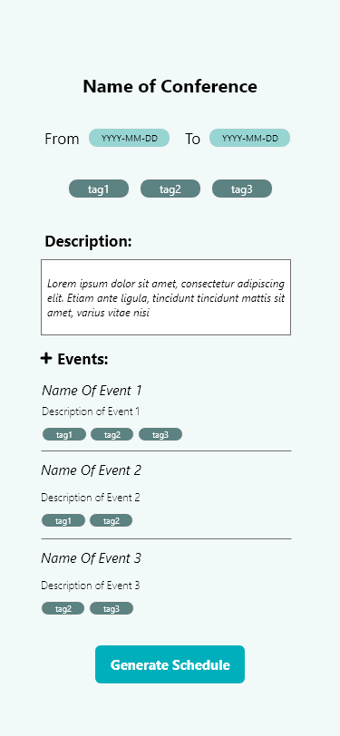
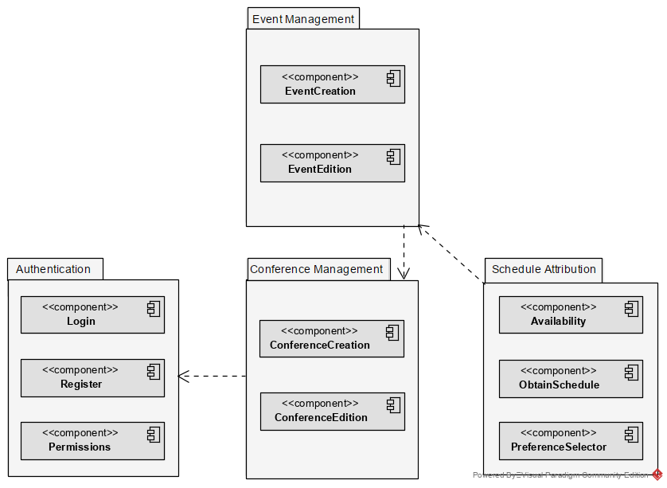

# openCX-T6G4-The-Five-Engineers Development Report

Welcome to the documentation pages of the *your (sub)product name* of **openCX**!

You can find here detailed about the (sub)product, hereby mentioned as module, from a high-level vision to low-level implementation decisions, a kind of Software Development Report (see [template](https://github.com/softeng-feup/open-cx/blob/master/docs/templates/Development-Report.md)), organized by discipline (as of RUP): 

* Business modeling 
  * [Product Vision](#Product-Vision)
  * [Elevator Pitch](#Elevator-Pitch)
* Requirements
  * [Use Case Diagram](#Use-case-diagram)
  * [User stories](#User-stories)
  * [Domain model](#Domain-model)
* Architecture and Design
  * [Logical architecture](#Logical-architecture)
  * [Physical architecture](#Physical-architecture)
  * [Prototype](#Prototype)
* [Implementation](#Implementation)
* [Test](#Test)
* [Configuration and change management](#Configuration-and-change-management)
* [Project management](#Project-management)

So far, contributions are exclusively made by the initial team, but we hope to open them to the community, in all areas and topics: requirements, technologies, development, experimentation, testing, etc.

Please contact us! 

Thank you!

- Beatriz Mendes
- Clara Martins
- Daniel Monteiro
- Gonçalo Pascoal
- João Mascarenhas

---

## Product Vision
To provide conference attendees with an automatic, personalized schedule to reduce time spent preparing for the conference.

---
## Elevator Pitch
Have you ever been to a conference only to find yourself running from one workshop to another and having to leave in the middle of the most interesting part just so you could see a little bit of another one? Or even failed to enter a workshop because the session was full? Then Eventee is the app for you. List your favorite workshops and it will give you a schedule without having to deal with partial sessions or full rooms.

---
## Requirements

In this section, you should describe all kinds of requirements for your module: functional and non-functional requirements.

Start by contextualizing your module, describing the main concepts, terms, roles, scope and boundaries of the application domain addressed by the project.

### Use case diagram 

**Version 2 - Third Sprint**

#### Main Description
* **Actors**
  * **Attendee** - the attendee is the main user of out app. He uses our product to decide which conferences he wants to attend and get the schedule with all the sessions which he revealed some interest.
  * **Event Organizer** - the event organizer is the user that gets our product to create and edit the conferences and events which he is responsible for. Without this user, the attendees don't get much value from the app. 
* **Description**
  * With this use case, the attendee can select a conference to attend and get his personalized schedule for that same conference. On the other hand, the event organizer can create new conferences with diferent sessions, which the attendees will be able to choose from all the available conferences.
* **Preconditions and Postconditions**
  * If we want to be able to use the final product, we need to create an account or login to ours, otherwise we can't get the personalized schedule for a conference or create a new one. At the conclusion of the use case execution, if we're the attendee, we will have a personalized schedule for a certain conference, while if we're the organizer, we can edit a conference that we created before.
* **Normal Flow**
  * With *Eventee*, it's possible to get all the important information about a conference which we want to attend and at the same time get the best possible schedule for us, simply by login-in or creating a new acount and provide our availabity and interest in sessions from a certain conference. After this, we can click on our main page and visualize our personalized schedule for the conference that we want to attend. On the other hand, if we want to organize a certain event, we can simply create it with our user-friendly interface, add new sessions to it and make it available for all the users of the app. If we want to edit a conference that we already created, we can do it and then notify all the attendees for that conference of the new changes.
* **Alternative Flows and Exceptions**
  * TODO

#### Register
* **Actors** - user of the app
* **Description** - in order to use the application, the user needs to be registered in the application, either as an attendee or as an organizer
* **Preconditions and Postconditions**
  * Preconditions: There are no preconditions
  * Postconditions: The user will have an account so he will be able to use our application
* **Normal Flow**
  1. User wants to use the application but doesn't have an account
  2. User presses the "Register" button
  3. User introduces all the information needed to create an account
  4. User creates an account
  5. The system registers the new user in the database
* **Alternative Flows and Exceptions**
  * If the user doens't type all the information needed, he can't create an account;
  * If the "confirm password" camp isn't equal to the "password" camp, the register process will fail and the user won't be able to create an account.
 
 #### Login
* **Actors** - user of the app
* **Description** - in order to use the application, the user needs to login in his account, either as an attendee or as an organizer
* **Preconditions and Postconditions**
  * Preconditions: The user must be registered
  * Postconditions: The user will be able to use our application
* **Normal Flow**
  1. User wants to use the application and has an account
  2. User presses the "Login" button
  3. User introduces all the information needed to login into his account
  4. User logs in
  5. The system presents all the information available to the user
* **Alternative Flows and Exceptions**
  * If the user doens't type all the information needed, he can't login into his account;
  * If the user doesn't introduce the information for a valid account, he won't be abble to login into his account.

#### Provide Availability and Interest in Conference Events
* **Actors** - attendee
* **Description**
* **Preconditions and Postconditions**
* **Normal Flow**
* **Alternative Flows and Exceptions**

#### Create a Conference
* **Actors** - event organizer
* **Description** - an organizer creates conferences so attendees have conferences to attend
* **Preconditions and Postconditions**
  * Preconditions: the person using the application must be logged in as an organizer
  * Postconditions: the system will have a new conference created by the user using the application
* **Normal Flow**
  1. Event organizer wants to create a new conference
  2. Event organizer fill all the spaces with the information needed to create a conference
  3. Event organizer adds events to the conference
  4. Event organizer creates the conference
  5. The system creates a new conference.
* **Alternative Flows and Exceptions**
  * If the event organizer doens't type all the information needed, he can't create a conference;
  * If the organizer doesn't want any event, the conference can be created without events, but attendees won't be able to attend the conference.

#### Schedule an Event
* **Actors** - event organizer
* **Description** - an organizer, while creating the conference or when editing the conference, wants to add events
* **Preconditions and Postconditions**
  * Preconditions: the person using the application must be logged in as an organizer and needs to select the conference or create a new conference
  * Postconditions: the conference that is being / is gonna be organized by the organizer will have a new event
* **Normal Flow**
  1. Event organizer wants to add an event to a conference
  2. Event organizer types all the information needed to create an event
  3. Event organizer adds sessions to the events
  4. Event organizer schedules an event
  5. The system schedules an event to the conference
* **Alternative Flows and Exceptions**
  * If the event organizer doens't type all the information needed, he can't schedule an event;
  * If the event organizer doesn't add sessions to the event, the event can't be created (needs at least 1 session).

#### Access Conference Data and Statistics
* **Actors** - event organizer
* **Description** - 
* **Preconditions and Postconditions**
  * Preconditions: 
  * Postconditions: 
* **Normal Flow**
  1. 
* **Alternative Flows and Exceptions**

#### Select a Conference
* **Actors** - user of the app
* **Description** - the user of the app wants select and view the information about a conference
* **Preconditions and Postconditions**
  * Preconditions: the user must be logged in in the application
  * Postconditions: the system will present all the information about the conference selected by the user
* **Normal Flow**
  1. User wants to access select a conference
  2. User presses the conference that wants so select
  3. The system presents the conference selected
* **Alternative Flows and Exceptions**
  * If there's no conferences to select, no conferences will be shown in the "Select Conference" menu

#### Consult the Assigned Personalized Schedule
* **Actors** - attendee
* **Description**
* **Preconditions and Postconditions**
* **Normal Flow**
* **Alternative Flows and Exceptions**

#### Notify/Survey Attendees about Events
* **Actors** - event organizer
* **Description**
* **Preconditions and Postconditions**
* **Normal Flow**
* **Alternative Flows and Exceptions**

### User stories

*As an organizer I want to be able to create a conference*

**User interface mockup**

**Acceptance tests**.
  * Name size <= 50 chars
  * Start date and finish date must be valid dates
  * Start date must be before or the same as finish date
  * Short description size <= 1000 chars

Given that I have the app,internet connection and I logged as an organizer.  
When I've figured all the information about the conference I want to arrange.  
Then the app should register all that data correctly.

**Value and effort**.
  * Must Have
  * M

*As an organizer, I want to be able to select a conference so that I can view it, edit it or see its statistics*

**User interface mockup**

**Acceptance tests**

* All conferences from the organizer that wants to select a conference have to be shown
* Can create a new conference from this screen
* Tapping a conference leads to a screen with more information about it

Given that I have the app and I'm logged in as an organizer.  
 When I want to access and/or modify all the information about the conference(s) that are already registered.   
Then the app should display all the conferences briefly and allow me to tap on them in order to see further informations and possibly edit them.  

**Value and effort**.
  * Must Have
  * M

*As an organizer, I want to be able to view information about a conference so that I can edit it and manage its events*

**User interface mockup**

**Acceptance tests**.

* Name, start and end dates, tags and description should be shown
* A list of all events from that conference should be shown
* Tapping an event leads to a screen with more information about it
* Can create a new event from this screen
* Can remove events, but a confirmation dialog should be shown

Given that I have the app and I'm logged in as an organizer.  
 When I want to access and/or modify all the information about the conference's events.   
Then the app should display all the conferences briefly and allow me to tap on them in order to see their events and to possibly add,alter or remove them.

**Value and effort**.
  * Must Have
  * S

*As an organizer, I want to be able to define sessions for an event*

**User interface mockup**

**Acceptance tests**.

* Session duration > 0
* It needs at least 1 speaker
* Maximum attendance > 0

Given that I have the app and I'm logged in as an organizer.  
When I want to access and/or modify all the information about each events'sessions.   
Then the app should display all the events of a conference and,for each event, allow me to tap on them in order to see their sessions and to possibly add,alter or remove them.

**Value and effort**.
  * Must Have
  * S

*As an organizer, I want to be able to control the session capacity*

**User interface mockup**

**Acceptance tests**  

Given that I have the app and I'm logged in as an organizer.
When I want to define a session's capacity due to technical or space limitations.  
Then the app , in each session's information screen , should allow me to alter the session capacity parameter and that should also reflect in the database.

**Value and effort**.
  * Should Have
  * XS

*As an organizer, I want to be able to register a new event so that I can manage a new conference*

**User interface mockup**

**Acceptance tests**.

* Name size <= 50 chars
* Start date and finish date of each session must be valid dates
* Start date of each session must be before or same as the finish date
* Start date of each session must be same or after conference start date
* Finish date of each session must be same or before conference finish date
* Maximum of 100 sessions (may change later)
* Maximum of 50 tags
* Tag size <= 50 chars
* Attendance limit, if it exists, must be a positive number
* Short description size <= 1000 chars  

Given that I have the app and I'm logged in as an organizer.
When I am in the screen regarding the creation of a new event.
Then the app should allow me to create a new event and,from that,create a new conference based on it.

**Value and effort**.
  * Must Have
  * L

*As an attendee, I want to be able to select a conference so I can see details about it or participate in it*

**User interface mockup**

**Acceptance tests**  

Given that I have the app and I'm logged in as an attendee.  
 When I want to access all the information about the conferences that I can attend.  
 Then the app should display all the conferences briefly and allow me to tap on them in order to see further informations and possibly participate in them. 

**Value and effort**.
  * Must Have
  * M

*As an attendee, I want to be notified when the sessions from the conference that I'm going to attend are added/removed/edited*

**User interface mockup**

**Acceptance tests**.
Given that I have the app, I'm logged in as an attendee and registered in a conference.  
When that conference's information has been modified.
Then the app should should generate a notification imediately regarding that specific change.

**Value and effort**.
  * Could Have
  * L

*As an organizer, I want to be able to check conference statistics* 

**User interface mockup**

**Acceptance tests**  

Given that I have the app, I'm logged in as an organizer and I've already created a conference.
When a conference has ocurred, I want to know which events and respective sessions had more interest for the attendee's and I also want to know which age group was more prevalent.  
Then the app should give me all the possible statistics regarding all the conference par

**Value and effort**.
  * Could Have
  * L

*As an organizer, I want to be able to login or register in the app*

**User interface mockup**

**Acceptance tests**
* Full name <= 300 characters
* Email <= 300 characters
* When registering an account as an organizer, attempting to log in as an attendee should display an error
* After successfully logging in, the user should be redirected to the conference selection screen
* An error should be displayed when:
  * Attempting to log in with an incorrect or invalid email / password  

Given that I have the app,an internet conection and I am an organizer of a conference.  
When I initially open the app and can't still manage or create any conferences.  
Then the app should display an initial login screen in order to enter and enjoy its many functionalities and also allow me to register if I still don't have an account.

**Value and effort**.
  * Should Have
  * M

*As an attendee, I want to be able to login or register in the app*

**User interface mockup**

**Acceptance tests**
* Full name <= 300 characters
* Email <= 300 characters
* When registering an account as an attendee, attempting to log in as an organizer should display an error
* After successfully logging in, the user should be redirected to the conference selection screen
* An error should be displayed when:
  * Attempting to log in with an incorrect or invalid email / password
  * Attempting to register a new account with an email that is already in use
  * Attempting to register an account with a weak password
  * Attempting to register an account and the password and confirm password fields don't match

Given that I have the app,an internet conection and I am an attendee of a conference.  
When I am not able to enter in the app and use all its functionalities.  
Then the app should display an initial login screen and also allow me to register if I still don't have an account.

**Value and effort**.
  * Should Have
  * M

*As an attendee, I want to be given the best schedule matching my availability so that I can participate in the most events possible*

**User interface mockup**

**Acceptance tests**  

Given that I have the app,am an attendee of a conference,have an internet conection,and have given the information about my availability.  
When I want to have time to go to all the events of the conference without having to worry much about it.  
Then the app should do all the work for me and provide me with the best possible schedule.

**Value and effort**.
  * Must Have
  * XL

*As an organizer I want to be able to view information about an event and its sessions so I can manage it*

**User interface mockup**

**Acceptance tests**.
* Name, description and tags should be shown
* A list of sessions from that conference should be shown
* Can create a new session from this screen
* Can remove sessions, but a confirmation dialog should be shown
  
Given that I have the app and I've logged in as an organizer .  
When I am managing an event.  
Then the app should allow me to view all the information about it and all its respective sessions providing me with the option to create and remove sessions.

**Value and effort**.
  * Must Have
  * M

### Domain model

To better understand the context of the software system, it is very useful to have a simple UML class diagram with all the key concepts (names, attributes) and relationships involved of the problem domain addressed by your module.

---

## Architecture and Design
### Logical architecture

  
  
  We can separate our code into four packages. :
*  The first one is authentication. This package manages the register, login, and permissions of the users.  
* The second one is the conference management. This one gathers the creation and edition of a conference.  
* The third one is similar to the second one, but handling events instead of conferences.  
* The fourth and last one is the most important, gathering all the unique features of our application. Here we collect the information needed to obtain an adaptive schedule for the conference. This information includes the attendee's availability as well as his preferences. After collecting all this information, the users will be able to obtain their personalized and unique schedules.

### Physical architecture

### Prototype
To help on validating all the architectural, design and technological decisions made, we usually implement a vertical prototype, a thin vertical slice of the system.

When creating our application, we thought about user commodity and facility.
With that in mind, we used flutter app to develop our user application. To synchronize all the data needed for the application to function properly, we needed a server. For that, we decided to use firebase. And, to store all the necessary data, we used a database in firestore.
All this technology combined allowed us to produce a mobile app, which interacts with the users to provide them a better experience when attending conferences.

---

## Implementation
Regular product increments are a good practice of product management. 

While not necessary, sometimes it might be useful to explain a few aspects of the code that have the greatest potential to confuse software engineers about how it works. Since the code should speak by itself, try to keep this section as short and simple as possible.

Use cross-links to the code repository and only embed real fragments of code when strictly needed, since they tend to become outdated very soon.

---
## Test

There are several ways of documenting testing activities, and quality assurance in general, being the most common: a strategy, a plan, test case specifications, and test checklists.

In this section it is only expected to include the following:
* test plan describing the list of features to be tested and the testing methods and tools;
* test case specifications to verify the functionalities, using unit tests and acceptance tests.
 
A good practice is to simplify this, avoiding repetitions, and automating the testing actions as much as possible.

---
## Configuration and change management

Configuration and change management are key activities to control change to, and maintain the integrity of, a project’s artifacts (code, models, documents).

For the purpose of ESOF, we will use a very simple approach, just to manage feature requests, bug fixes, and improvements, using GitHub issues and following the [GitHub flow](https://guides.github.com/introduction/flow/).

---

## Project management

Software project management is an art and science of planning and leading software projects, in which software projects are planned, implemented, monitored and controlled.

In the context of ESOF, we expect that each team adopts a project management tool capable of registering tasks, assign tasks to people, add estimations to tasks, monitor tasks progress, and therefore being able to track their projects.

Example of tools to do this are:
  * [Trello.com](https://trello.com)
  * [Github Projects](https://github.com/features/project-management/com)
  * [Pivotal Tracker](https://www.pivotaltracker.com)
  * [Jira](https://www.atlassian.com/software/jira)

We recommend to use the simplest tool that can possibly work for the team.

---

## Evolution - contributions to open-cx

Describe your contribution to open-cx (iteration 5), linking to the appropriate pull requests, issues, documentation.
