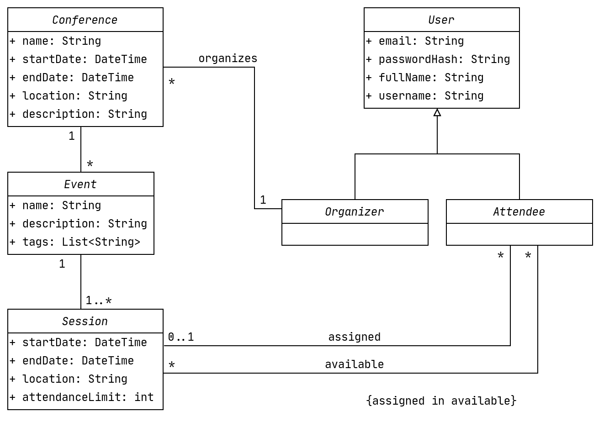

# openCX-T6G4-The-Five-Engineers Development Report

Welcome to the documentation pages of the *your (sub)product name* of **openCX**!

You can find here detailed about the (sub)product, hereby mentioned as module, from a high-level vision to low-level implementation decisions, a kind of Software Development Report (see [template](https://github.com/softeng-feup/open-cx/blob/master/docs/templates/Development-Report.md)), organized by discipline (as of RUP): 

* Business modeling 
  * [Product Vision](#Product-Vision)
  * [Elevator Pitch](#Elevator-Pitch)
* Requirements
  * [Use Case Diagram](#Use-case-diagram)
  * [User stories](#User-stories)
  * [Domain model](#Domain-model)
* Architecture and Design
  * [Logical architecture](#Logical-architecture)
  * [Physical architecture](#Physical-architecture)
  * [Prototype](#Prototype)
* [Implementation](#Implementation)
* [Test](#Test)
* [Configuration and change management](#Configuration-and-change-management)
* [Project management](#Project-management)

So far, contributions are exclusively made by the initial team, but we hope to open them to the community, in all areas and topics: requirements, technologies, development, experimentation, testing, etc.

Please contact us! 

Thank you!

- Beatriz Mendes
- Clara Martins
- Daniel Monteiro
- Gonçalo Pascoal
- João Mascarenhas

---

## Product Vision
To provide conference attendees with a personalized schedule.

---
## Elevator Pitch
Have you ever been to a conference only to find yourself running from one workshop to another and having to leave in the middle of the most interesting part just so you could see a little bit of another one? Or even failed to enter a workshop because the session was full? Then Eventee is the app for you. List your favorite workshops and it will give you a schedule without having to deal with partial sessions or full rooms.

---
## Requirements

In this section, you should describe all kinds of requirements for your module: functional and non-functional requirements.

Start by contextualizing your module, describing the main concepts, terms, roles, scope and boundaries of the application domain addressed by the project.

### Use case diagram 

Create a use-case diagram in UML with all high-level use cases possibly addressed by your module.

Give each use case a concise, results-oriented name. Use cases should reflect the tasks the user needs to be able to accomplish using the system. Include an action verb and a noun. 

Briefly describe each use case mentioning the following:

* **Actor**. Name only the actor that will be initiating this use case, i.e. a person or other entity external to the software system being specified who interacts with the system and performs use cases to accomplish tasks. 
* **Description**. Provide a brief description of the reason for and outcome of this use case, or a high-level description of the sequence of actions and the outcome of executing the use case. 
* **Preconditions and Postconditions**. Include any activities that must take place, or any conditions that must be true, before the use case can be started (preconditions). Describe also the state of the system at the conclusion of the use case execution (postconditions). 

* **Normal Flow**. Provide a detailed description of the user actions and system responses that will take place during execution of the use case under normal, expected conditions. This dialog sequence will ultimately lead to accomplishing the goal stated in the use case name and description. This is best done as a numbered list of actions performed by the actor, alternating with responses provided by the system. 
* **Alternative Flows and Exceptions**. Document other, legitimate usage scenarios that can take place within this use case, stating any differences in the sequence of steps that take place. In addition, describe any anticipated error conditions that could occur during execution of the use case, and define how the system is to respond to those conditions. 

**Version 2 - Third Sprint**

* **Actors**
  * **Attendee** - the attendee is the main user of out app. He uses our product to decide which conferences he wants to attend and get the schedule with all the sessions which he revealed some interest.
  * **Event Organizer** - the event organizer is the user that gets our product to create and edit the conferences and events which he is responsible for. Without this user, the attendees don't get much value from the app. 
* **Description**
  * With this use case, the attendee can select a conference to attend and get his personalized schedule for that same conference. On the other hand, the event organizer can create new conferences with diferent sessions, which the attendees will be able to choose from all the available conferences.
* **Preconditions and Postconditions**
  * If we want to be able to use the final product, we need to create an account or login to ours, otherwise we can't get the personalized schedule for a conference or create a new one. At the conclusion of the use case execution, if we're the attendee, we will have a personalized schedule for a certain conference, while if we're the organizer, we can edit a conference that we created before.
* **Normal Flow**
  * With *Eventee*, it's possible to get all the important information about a conference which we want to attend and at the same time get the best possible schedule for us, simply by login-in or creating a new acount and provide our availabity and interest in sessions from a certain conference. After this, we can click on our main page and visualize our personalized schedule for the conference that we want to attend. On the other hand, if we want to organize a certain event, we can simply create it with our user-friendly interface, add new sessions to it and make it available for all the users of the app. If we want to edit a conference that we already created, we can do it and then notify all the attendees for that conference of the new changes.
* **Alternative Flows and Exceptions**
  * TODO

### User stories
This section will contain the requirements of the product described as **user stories**, organized in a global **[user story map](https://plan.io/blog/user-story-mapping/)** with **user roles** or **themes**.

For each theme, or role, you may add a small description. User stories should be detailed in the tool you decided to use for project management (e.g. trello or github projects).

A user story is a description of desired functionality told from the perspective of the user or customer. A starting template for the description of a user story is 

*As a < user role >, I want < goal > so that < reason >.*

**INVEST in good user stories**. 
You may add more details after, but the shorter and complete, the better. In order to decide if the user story is good, please follow the [INVEST guidelines](https://xp123.com/articles/invest-in-good-stories-and-smart-tasks/).

**User interface mockups**.
After the user story text, you should add a draft of the corresponding user interfaces, a simple mockup or draft, if applicable.

**Acceptance tests**.
For each user story you should write also the acceptance tests (textually in Gherkin), i.e., a description of scenarios (situations) that will help to confirm that the system satisfies the requirements addressed by the user story.

**Value and effort**.
At the end, it is good to add a rough indication of the value of the user story to the customers (e.g. [MoSCoW](https://en.wikipedia.org/wiki/MoSCoW_method) method) and the team should add an estimation of the effort to implement it, for example, using t-shirt sizes (XS, S, M, L, XL).

- Using MoSCoW method and t-shirt sizes; 

*As an organizer I want to be able to create a conference*

**User interface mockup**

**Acceptance tests**.
  * Name size <= 50 chars
  * Start date and finish date must be valid dates
  * Start date must be before or the same as finish date
  * Short description size <= 1000 chars

**Value and effort**.
  * Must Have
  * M

*As an organizer, I want to be able to select a conference so that I can view it, edit it or see its statistics*

**User interface mockup**

**Acceptance tests**.
  TODO

**Value and effort**.
  * Must Have
  * M

*As an organizer, I want to be able to view information about a conference so that I can edit it and manage its events*

**User interface mockup**

**Acceptance tests**.

* Name, start and end dates, tags and description should be shown
* A list of all events from that conference should be shown
* Tapping an event leads to a screen with more information about it
* Can create a new event from this screen
* Can remove events, but a confirmation dialog should be shown

**Value and effort**.
  * Must Have
  * S

*As an organizer, I want to be able to define sessions for an event*

**User interface mockup**

TODO

**Acceptance tests**.

TODO

**Value and effort**.
  * Must Have
  * S

*As an organizer, I want to be able to control the session capacity*

**User interface mockup**

TODO

**Acceptance tests**.

TODO

**Value and effort**.
  * Should Have
  * XS

*As an organizer, I want to be able to register a new event so that I can manage a new conference*

**User interface mockup**

TODO

**Acceptance tests**.

TODO

**Value and effort**.
  * Must Have
  * L

*As an attendee, I want to be able to select a conference so I can see details about it or participate in it*

**User interface mockup**

TODO

**Acceptance tests**.

TODO

**Value and effort**.
  * Must Have
  * M

*As an attendee, I want to be notified when the sessions from the conference that I'm going to attend are added/removed/edited*

**User interface mockup**

TODO

**Acceptance tests**.

TODO

**Value and effort**.
  * Could Have
  * L

*As an organizer, I want to be able to check conference statistics*

**User interface mockup**

TODO

**Acceptance tests**.

TODO

**Value and effort**.
  * Could Have
  * L

*As an organizer, I want to be able to login or register in the app*

**User interface mockup**

TODO

**Acceptance tests**.

TODO

**Value and effort**.
  * Should Have
  * M

*As an attendee, I want to be able to login or register in the app*

**User interface mockup**

TODO

**Acceptance tests**.

TODO

**Value and effort**.
  * Should Have
  * M

*As an attendee, I want to be given the best schedule matching my availability so that I can participate in the most events possible*

**User interface mockup**

TODO

**Acceptance tests**.

TODO

**Value and effort**.
  * Must Have
  * XL

### Domain model

To better understand the context of the software system, it is very useful to have a simple UML class diagram with all the key concepts (names, attributes) and relationships involved of the problem domain addressed by your module.

---

## Architecture and Design
The architecture of a software system encompasses the set of key decisions about its overall organization. 

A well written architecture document is brief but reduces the amount of time it takes new programmers to a project to understand the code to feel able to make modifications and enhancements.

To document the architecture requires describing the decomposition of the system in their parts (high-level components) and the key behaviors and collaborations between them. 

In this section you should start by briefly describing the overall components of the project and their interrelations. You should also describe how you solved typical problems you may have encountered, pointing to well-known architectural and design patterns, if applicable.

### Logical architecture

### Physical architecture

### Prototype
To help on validating all the architectural, design and technological decisions made, we usually implement a vertical prototype, a thin vertical slice of the system.

In this subsection please describe in more detail which, and how, user(s) story(ies) were implemented.

---

## Implementation
Regular product increments are a good practice of product management. 

While not necessary, sometimes it might be useful to explain a few aspects of the code that have the greatest potential to confuse software engineers about how it works. Since the code should speak by itself, try to keep this section as short and simple as possible.

Use cross-links to the code repository and only embed real fragments of code when strictly needed, since they tend to become outdated very soon.

---
## Test

There are several ways of documenting testing activities, and quality assurance in general, being the most common: a strategy, a plan, test case specifications, and test checklists.

In this section it is only expected to include the following:
* test plan describing the list of features to be tested and the testing methods and tools;
* test case specifications to verify the functionalities, using unit tests and acceptance tests.
 
A good practice is to simplify this, avoiding repetitions, and automating the testing actions as much as possible.

---
## Configuration and change management

Configuration and change management are key activities to control change to, and maintain the integrity of, a project’s artifacts (code, models, documents).

For the purpose of ESOF, we will use a very simple approach, just to manage feature requests, bug fixes, and improvements, using GitHub issues and following the [GitHub flow](https://guides.github.com/introduction/flow/).

---

## Project management

Software project management is an art and science of planning and leading software projects, in which software projects are planned, implemented, monitored and controlled.

In the context of ESOF, we expect that each team adopts a project management tool capable of registering tasks, assign tasks to people, add estimations to tasks, monitor tasks progress, and therefore being able to track their projects.

Example of tools to do this are:
  * [Trello.com](https://trello.com)
  * [Github Projects](https://github.com/features/project-management/com)
  * [Pivotal Tracker](https://www.pivotaltracker.com)
  * [Jira](https://www.atlassian.com/software/jira)

We recommend to use the simplest tool that can possibly work for the team.

---

## Evolution - contributions to open-cx

Describe your contribution to open-cx (iteration 5), linking to the appropriate pull requests, issues, documentation.
