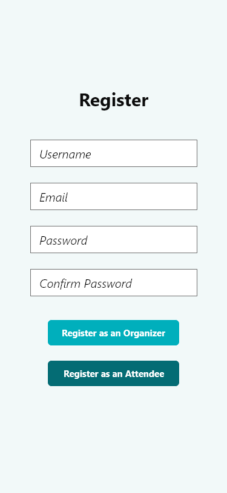
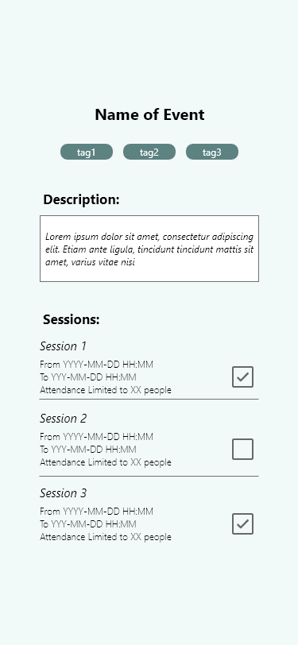
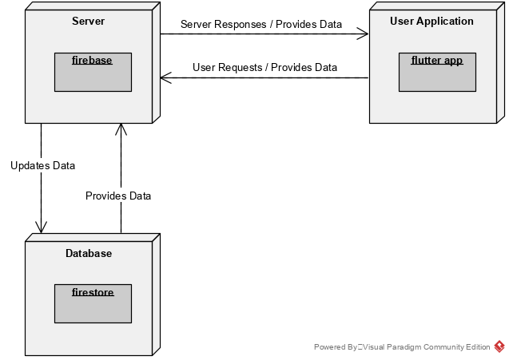

# openCX-T6G4-The-Five-Engineers Development Report

Welcome to the documentation pages of *Eventee* of **openCX**!

You can find here detailed about Eventee, hereby mentioned as module, from a high-level vision to low-level implementation decisions, a kind of Software Development Report (see [template](https://github.com/softeng-feup/open-cx/blob/master/docs/templates/Development-Report.md)), organized by discipline (as of RUP): 

* Business modeling 
  * [Product Vision](#Product-Vision)
  * [Elevator Pitch](#Elevator-Pitch)
* Requirements
  * [Use Case Diagram](#Use-case-diagram)
  * [User stories](#User-stories)
  * [Domain model](#Domain-model)
* Architecture and Design
  * [Logical architecture](#Logical-architecture)
  * [Physical architecture](#Physical-architecture)
* [Implementation](#Implementation)
* [Test](#Test)
* [Configuration and change management](#Configuration-and-change-management)
* [Project management](#Project-management)

So far, contributions are exclusively made by the initial team, but we hope to open them to the community, in all areas and topics: requirements, technologies, development, experimentation, testing, etc.

Please contact us! 

Thank you!

- Beatriz Mendes
- Clara Martins
- Daniel Monteiro
- Gonçalo Pascoal
- João Mascarenhas

---

## Product Vision
To provide conference attendees with an automatic, personalized schedule to reduce time spent preparing for the conference.

---
## Elevator Pitch
Have you ever been to a conference only to find yourself running from one workshop to another and having to leave in the middle of the most interesting part, just so you could see a little bit of another one? Or even failed to enter a workshop because the session was full? Then, Eventee is the app for you. List your favorite events and preferred sessions and it will automatically provide you with a schedule without overlapping sessions.

---
## Requirements

### Use case diagram 


#### Register
* **Actors** - users of the app
* **Description** - in order to use the application, the user needs to be registered either as an attendee or as an organizer
* **Preconditions and Postconditions**
  * Preconditions: none
  * Postconditions: the user will have an account so they will be able to use the other functionalities of our app
* **Normal Flow**
  1. User wants to use the application but doesn't have an account
  2. User presses the "Register" button
  3. User introduces all the information needed to create an account
  4. User creates an account (either as an attendee or as an organizer)
  5. The user's information is added to the database
* **Alternative Flows and Exceptions**
  * The register process will fail and an error message will be displayed if:
    * The user doesn't enter all the required information;
    * The "confirm password" field isn't equal to the "password" field;
    * The provided email is already in use.
 
 #### Login
* **Actors** - users of the app
* **Description** - in order to use the application, the user needs to login to their account, either as an attendee or as an organizer
* **Preconditions and Postconditions**
  * Preconditions: the user must be registered
  * Postconditions: the user will be able to use our application
* **Normal Flow**
  1. User wants to use the application and has an account
  2. User presses the "Login" button
  3. User introduces their email and password
  4. User logs in (either as an attendee or as an organizer)
  5. The app presents all the information available to the user
* **Alternative Flows and Exceptions**
  * The login process will fail and an error message will be displayed if:
    * The user doesn't enter all the required information;
    * The user enters a wrong email or password;
    * The user logs in with the wrong role (for example, an attendee attempts to log in as an organizer).

#### Provide Availability and Interest in Conference Events
* **Actors** - conference attendee
* **Description** - an attendee provides their availability and interest in conference events so that he can obtain a personalized schedule
* **Preconditions and Postconditions**
  * Preconditions: the user must be logged in as an attendee and he must have selected a conference
  * Postconditions: the availability and interests for the user will be set for this conference
* **Normal Flow**
  1. Attendee wants to participate in a conference
  2. Attendee selects the events he would like to attend
  3. Attendee selects their availability for those events
  4. The attendee's interests and availability are stored in the database
* **Alternative Flows and Exceptions**
  * If the user cancels, their availability and interests won't be registered

#### Create a Conference
* **Actors** - conference organizer
* **Description** - an organizer creates a conference and provides information about it so that it can be discovered by other users of the app
* **Preconditions and Postconditions**
  * Preconditions: the user must be logged in as an organizer
  * Postconditions: a new conference organized by the user will be created
* **Normal Flow**
  1. Event organizer wants to create a new conference
  2. Event organizer fills all the required information to create a conference (name, description, start and end dates, location, etc.)
  3. Event organizer creates the conference
  4. The conference data is added to the database
* **Alternative Flows and Exceptions**
  * If the event organizer doesn't enter all the required information, he can't create a conference;

#### Schedule an Event
* **Actors** - conference organizer
* **Description** - an organizer, while managing a conference, adds events like talks and workshops in which conference attendees can participate
* **Preconditions and Postconditions**
  * Preconditions: the user must be logged in as an organizer and have a conference selected
  * Postconditions: the conference that is organized by the user will have a new event
* **Normal Flow**
  1. Event organizer wants to add an event to a conference
  2. Event organizer enters all the required information to create an event
  3. Event organizer adds sessions to the events
  4. Event organizer schedules an event
  5. The event's data is addded to the database
* **Alternative Flows and Exceptions**
  * The event won't be created and an error message will be displayed if:
    * The event organizer doesn't enter all the required information;
    * The event organizer doesn't add at least one session to the event.

#### Access Conference Data and Statistics (Not Implemented)
* **Actors** - conference organizer
* **Description** - an organizer wants to see which events / sessions are more popular so he checks the conference statistics
* **Preconditions and Postconditions**
  * Preconditions: the user must be logged in as an organizer, have a conference selected and the schedules for it must already be generated
  * Postconditions: the organizer will be able to the see attendance rates for the conference events and sessions
* **Normal Flow**
  1. Event organizer wants to acess statistics for a conference
  2. Event organizer selects the option to see statistics for the conference
  3. The app presents the statistics for the conferences
* **Alternative Flows and Exceptions**
  * If the schedules haven't been generated, the statistics will be empty.

#### Select a Conference
* **Actors** - user of the app
* **Description** - the user of the app wants to select and view information about a conference
* **Preconditions and Postconditions**
  * Preconditions: the user must be logged in
  * Postconditions: the app will present all the information about the conference selected by the user
* **Normal Flow**
  1. User wants to access information about a conference
  2. User presses the conference they want to view
  3. The app presents information about the selected the conference
* **Alternative Flows and Exceptions**: none

#### Consult their Assigned Personalized Schedule
* **Actors** - conference attendee
* **Description** - an attendee wants to see their personalized schedule to know which sessions the app has assigned to him
* **Preconditions and Postconditions**
  * Preconditions: the user must be logged in as an attendee, have filled their availability and interests for this conference and the conference organizer must have generated the schedules for the conference
  * Postconditions: the app will present the personalized schedule
* **Normal Flow**
  1. Attendee wants to check their schedule
  2. Attendee selects the option to check their personalized schedule
  3. The app presents the user's personalized schedule
* **Alternative Flows and Exceptions**
  * If the conference organizer hasn't generated the schedules, the option for checking them won't be shown;
  * If the user didn't provide their availability or interests, no schedule will be shown.

#### Notify Attendees about Events (Not Implemented)
* **Actors** - conference attendee
* **Description** - the attendee wants to be notified for eventual changes in the events and conferences he will be attending 
* **Preconditions and Postconditions**
  * Preconditions: the attendee must have filled their availability and interests for that conference and the conference organizer must have altered the conference data
  * Postconditions: the attendee will receive a notification about the changes
* **Normal Flow**
  1. The attendee decides they want to be notified about changes in a conference
  2. The conference organizer modifies that conference
  3. The attendee receives a notification about the changes
* **Alternative Flows and Exceptions**: none

### User stories

#### User Story Map - Attendee


#### User Story Map - Organizer


#### *As an organizer, I want to be able to login or register in the app*

**User interface mockup**


**Acceptance tests**
* Full name <= 300 characters
* Email <= 300 characters
* When registering an account as an organizer, attempting to log in as an attendee should display an error
* After successfully logging in, the user should be redirected to the conference selection screen
* An error should be displayed when:
  * Attempting to log in with an incorrect or invalid email / password
  * Attempting to register a new account with an email that is already in use
  * Attempting to register an account with a weak password
  * Attempting to register an account and the password and confirm password fields don't match  

```gherkin
Given that I have the app, an internet conection and I am a conference organizer.  
When I initially open the app and can't still manage or create any conferences.
Then the app should display an initial login screen in order to enter and enjoy its many functionalities and also allow me to register if I still don't have an account.
```

**Value and effort**.
  * Should Have
  * M

#### *As an attendee, I want to be able to login or register in the app*

**User interface mockup**




**Acceptance tests**
* Full name <= 300 characters
* Email <= 300 characters
* When registering an account as an attendee, attempting to log in as an organizer should display an error
* After successfully logging in, the user should be redirected to the conference selection screen
* An error should be displayed when:
  * Attempting to log in with an incorrect or invalid email / password
  * Attempting to register a new account with an email that is already in use
  * Attempting to register an account with a weak password
  * Attempting to register an account and the password and confirm password fields don't match

```gherkin
Given that I have the app, an internet conection and I am an attendee of a conference.  
When I am not able to enter in the app and use all its functionalities.  
Then the app should display an initial login screen and also allow me to register if I still don't have an account.
```

**Value and effort**.
  * Should Have
  * M

#### *As an organizer I want to be able to create a conference*

**User interface mockup**


**Acceptance tests**.
  * Name size <= 50 chars
  * Start date and finish date must be valid dates
  * Start date must be before or the same as finish date
  * Short description size <= 1000 chars

```gherkin
Given that I have the app, internet connection and I logged in as an organizer.  
When I've figured all the information about the conference I want to arrange.  
Then the app should register all that data correctly.
```

**Value and effort**.
  * Must Have
  * M

#### *As an organizer, I want to be able to select a conference so that I can view it and edit it*

**User interface mockup**


**Acceptance tests**

* All conferences from the organizer that wants to select a conference have to be shown
* Can create a new conference from this screen
* Tapping a conference leads to a screen with more information about it

```gherkin
Given that I have the app and I'm logged in as an organizer.  
 When I want to access and/or modify all the information about the conference(s) that are already registered.   
Then the app should display all the conferences briefly and allow me to tap on them in order to see further informations and possibly edit them.  
```

**Value and effort**.
  * Must Have
  * M

#### *As an organizer, I want to be able to view information about a conference so that I can edit it and manage its events*

**User interface mockup**


**Acceptance tests**.

* Name, start and end dates, tags and description should be shown
* A list of all events from that conference should be shown
* Tapping an event leads to a screen with more information about it
* Can create a new event from this screen
* Can remove events, but a confirmation dialog should be shown

```gherkin
Given that I have the app and I'm logged in as an organizer.  
 When I want to access and/or modify all the information about the conference's events.   
Then the app should display all the conferences briefly and allow me to tap on them in order to see their events and to possibly add, modify or remove them.
```

**Value and effort**.
  * Must Have
  * S

####  *As an organizer, I want to be able to define sessions for an event*

**User interface mockup**


**Acceptance tests**
* Session duration > 0
* It needs at least 1 speaker
* Maximum attendance > 0

```gherkin
Given that I have the app and I'm logged in as an organizer.  
When I want to access and/or modify all the information about each events' sessions.   
Then the app should display all the events of a conference and, for each event, allow me to tap on them in order to see their sessions and to possibly add, alter or remove them.
```

**Value and effort**.
  * Must Have
  * S

#### *As an organizer, I want to be able to control the session capacity*

**User interface mockup**


**Acceptance tests** 
* Maximum attendance > 0

```gherkin
Given that I have the app and I'm logged in as an organizer.
When I want to define a session's capacity due to technical or space limitations.  
Then the app, in each session's information screen, should allow me to alter the session capacity parameter and that should also reflect in the database.
```

**Value and effort**
  * Should Have
  * XS

#### *As an organizer, I want to be able to register a new event so that I can manage a new conference*

**User interface mockup**


**Acceptance tests**.

* Name size <= 50 chars
* Start date and finish date of each session must be valid dates
* Start date of each session must be before or same as the finish date
* Start date of each session must be same or after conference start date
* Finish date of each session must be same or before conference finish date
* Maximum of 100 sessions (may change later)
* Maximum of 50 tags
* Tag size <= 50 chars
* Attendance limit, if it exists, must be a positive number
* Short description size <= 1000 chars  

```gherkin
Given that I have the app and I'm logged in as an organizer.
When I am in the screen regarding the creation of a new event.
Then the app should allow me to create a new event and, from that, create a new conference based on it.
```

**Value and effort**.
  * Must Have
  * L


#### *As an organizer I want to be able to view information about an event and its sessions so I can manage it*

**User interface mockup**


**Acceptance tests**.
* Name, description and tags should be shown
* A list of sessions from that conference should be shown
* Can create a new session from this screen
* Can remove sessions, but a confirmation dialog should be shown
  
```gherkin
Given that I have the app and I've logged in as an organizer.  
When I am managing an event.  
Then the app should allow me to view all the information about it and all its respective sessions providing me with the option to create and remove sessions.
```

**Value and effort**.
  * Must Have
  * M


#### *As an attendee, I want to be able to select a conference so I can see details about it or participate in it*

**User interface mockup**


**Acceptance tests**  

```gherkin
Given that I have the app and I'm logged in as an attendee.  
 When I want to access all the information about the conferences that I can attend.  
 Then the app should display all the conferences briefly and allow me to tap on them in order to see further informations and possibly participate in them. 
```

**Value and effort**.
  * Must Have
  * M

#### *As an attendee, I want to be able to give my availability for events so that I can be provided with an automatic, personalized schedule*

**User interface mockup**



**Acceptance tests**  
* A checkbox should be shown near each session to provide availability for that session
* The cancel button (cross) should let the user return to the normal event view
* Results should be submitted to the database only after the confirm button (checkmark) is pressed

```gherkin
Given that I have the app ,that I'm logged in as an attendee and I know my availability during the conference events.
When I want to register which events I'm interested in and match my availabity.
Then the app should allow me to,through checkboxes next to the list of events,select which ones respect the conditions mentioned.
```

**Value and effort**.
  * Must Have
  * L

#### *As an attendee, I want to be able to view my personalized schedule so that I can attend the events I'm interested in*

**User interface mockup**


**Acceptance tests**  
* The sessions assigned to the attendee by the algorithm should be shown in chronological order
* Each entry in the schedule should show the event name, and the start and end dates of the assigned session

```gherkin
Given that I have the app, I am an attendee of a conference, have an internet conection, and have given the information about my availability.  
When I want to have time to go to all the events of the conference without having to worry much about it and I've tapped on "View Schedule".  
Then the app should do all the work for me and show the best possible schedule.
```

**Value and effort**.
  * Must Have
  * XL

#### *As an attendee, I want to be notified when the sessions from the conference that I'm going to attend are added/removed/edited*

**User interface mockup**

(Not Implemented)

**Acceptance tests**

(Not Implemented)

```gherkin
Given that I have the app, I'm logged in as an attendee and registered in a conference.  
When that conference's information has been modified.
Then the app should should generate a notification imediately regarding that specific change.
```

**Value and effort**.
  * Could Have
  * L

#### *As an organizer, I want to be able to check conference statistics* 

**User interface mockup**

(Not Implemented)

**Acceptance tests**  

(Not Implemented)

```gherkin
Given that I have the app, I'm logged in as an organizer and I've already created a conference.
When a conference has ocurred, I want to know which events and respective sessions had more interest for the attendee's and I also want to know which age group was more prevalent.  
Then the app should give me all the possible statistics regarding all the conference participants.
```

**Value and effort**.
  * Could Have
  * L

### Domain model


This UML diagram displays some of the main concepts involved in our project. We considered that a **Conference** is composed of several **Events**. **Event** is a broad concept that describes any interesting activity that could be part of a conference, that is: talks, workshops, keynotes, panels, etc. Each **Event** would then have a variable amount of **Sessions**, which describe the date(s) when the event will take place. Our app is focused on providing an automatic schedule, therefore conference attendees are able to give their availability for the various **Sessions** of an **Event** and be assigned to one of these sessions by the scheduling algorithm. These interactions are represented in the diagram by the *available* and *assigned* relations.

---

## Architecture and Design
### Logical architecture

  
  
We can separate our code into four main packages:
*  The first one is authentication. This package manages the register, login, and permissions of the different users, relying on role-based access control.  
* The second one is the conference management. This one gathers the creation and management of a conference.  
* The third one is similar to the second one, but is focused on events (talks / workshops) instead of conferences.  
* The fourth and last one is the most important, containing all the unique features of our application. Here we collect the information needed to generate automatic and personalized schedules for the conference. This information includes the attendee's availability as well as his preferences. After collecting this information, our scheduling algorithm will be able to generate personalized schedules that conference attendees can then consult.

### Physical architecture



When developing our application, we thought about user commodity and usability.
With that in mind, we used the Flutter SDK to develop our application.  
To synchronize all the data required for the application to function properly, we needed a server. For that, we decided to use Firebase, a Google platform with an extensive set of features. To store all the necessary data, we used a NoSQL database provided by Firebase, named Cloud Firestore.  
Using all these technologies allowed us to produce a mobile app, which interacts with the users to provide them a better experience when attending conferences.

---

## Implementation

* **Iteration 0**: decided technologies to use; learned the basics of Flutter; created user stories and mockups
* **Iteration 1**: implemented the "create conference" menu for the organizer; learned more details about Flutter
* **Iteration 2**: Firebase setup; started to implement other user stories fundamental for the app; updated some mockups
* **Iteration 3**: implementation of more user stories; updated some mockups; connection to the Firebase
* **Iteration 4**: implementation of core user stories; scheduling algorithm; updated some mockups; gherkin test automation

---
## Test

### Test Plan
For this project, we created two types of automated tests: unit tests using Flutter and Dart's default testing framework and Gherkin acceptance tests using the `flutter_gherkin` package. For the unit tests, we chose to first create a test for the scheduling algorithm we developed, since this would be a good way to verify that it was working properly before integrating it with the rest of the app. We also developed some tests for the **Create Session** screen. As for the automated acceptance tests, since the main objective of these tests was to gain experience with BDD, we decided to test the **Login** feature, in scenarios with both valid and invalid user input.

We would have liked to create more unit tests for several of the app's features, however since most of the testable features, such as conference, event and session creation rely on picking dates, something which is hard to test with Flutter's default testing framework (which only supports `tap`, `drag` and `enterText` actions), we were unable to easily develop tests for these features.

### Test Case Specifications

#### Unit Tests
For the scheduling algorithm, a basic test was developed which took in some predefined conference data (so that this test would be independent of the database integration) and applied the algorithm to it. Afterwards, the results are displayed (in this case, the users that were assigned to each session of each event).

The tests for the **Create Session** screen focus on input validation of the limited attendance field (maximum number of people that can participate in the session), testing invalid input such as a negative limit, a fractional limit, zero and even text input.

#### Acceptance Tests
For the Gherkin acceptance tests, we defined two scenarios for the **Login** feature: one where the user would input the correct credentials and another where he would input incorrect credentials:
```gherkin
Scenario: Login with correct credentials
  Given I fill the 'email' field with 'attendee@email.com'
  And I fill the 'password' field with 'password'
  When I tap the 'Login as Attendee' button
  Then I expect the text 'Select Conference' to be present within 10 seconds
  
Scenario: Login with incorrect credentials
  Given I fill the 'email' field with 'attendee@email.com'
  And I fill the 'password' field with 'wrongpassword'
  When I tap the 'Login as Attendee' button
  Then I expect the widget 'error dialog' to be present within 10 seconds
```
The first scenario expects the **Select a Conference** screen to be present after a valid authentication, whilst the second scenario expects an error message to be shown.

---
## Configuration and change management

For the purpose of ESOF, we used a simple but effective approach to manage features, bug fixes, and improvements by following [GitHub flow](https://guides.github.com/introduction/flow/). To follow this strategy, we:

* Used a **development branch** in order to avoid pollution of the master branch
* Used **branches** for every new feature and enhancement, using easy-to-understand names (`feature-name` for feature branches, `enhancement-name` for enhancements);
* Used **pull requests** when a branch was ready to be added to the `dev` branch, requesting review of the other developers;
* Used **release branches** and **tags** for every product iteration;
* Controlled merging of branches to the `dev` branch, so that everything that is added to the `dev` branch has undergone some degree of testing;
* Ensured that the only commits made directly to the `master` branch were changes to the documentation (in our case, the project report). However, we did use branches for more complex changes to the report to avoid conflicts.

Check our Network Graph [here](https://github.com/FEUP-ESOF-2020-21/open-cx-t6g4-the-five-engineers/network).

---

## Project management

For project management, in the context of ESOF, our team decided to use [Github Projects](https://github.com/FEUP-ESOF-2020-21/open-cx-t6g4-the-five-engineers/projects). This way we were able to create and categorize tasks, assign them to team members, add estimations to tasks, monitor their progress, and keep track of the general development of our project.

---

## Evolution - contributions to open-cx

Describe your contribution to open-cx (iteration 5), linking to the appropriate pull requests, issues, documentation.
